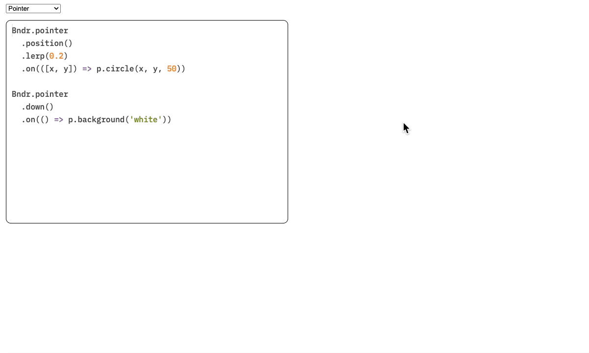

<div align="center">

  

  <h1>Bndr</h1>
  <p>🖱️ ⌇ ⌨️ ⌇ 🎹 ⌇ 🎮 ⌇ 🖊️ ⌇ 👆</p>

  

<a href="https://baku89.github.io/bndr-js/">Doc</a> ⌇ <a href="https://baku89.github.io/bndr-js/sandbox">Sandbox</a> ⌇ <a href="https://baku89.github.io/bndr-js/api/">API</a> ⌇ <a href="https://github.com/sponsors/baku89">Become a Sponsor</a>

<p>
  <a href="https://www.npmjs.org/package/bndr-js">
    
  </a>
  <a href="http://spdx.org/licenses/MIT">
    
  </a>
</p>

</div>

**Bndr** /ˈbaɪndɚ/ is a library designed to compose events from various user inputs and chain filters in a monadic manner, integrating them into a single event object. It accommodates input devices such as mice🖱️, styluses🖊️, touch inputs👆, keyboards⌨️, [MIDI](https://developer.mozilla.org/en-US/docs/Web/API/Web_MIDI_API) controllers🎹, and [gamepads](https://developer.mozilla.org/en-US/docs/Web/API/Gamepad_API)🎮. Developed and maintained by [Baku Hashimoto](https://baku89.com).

Potential use cases for this library include:

- ⚡️ Associating user inputs with arbitrary triggers for VJing
- 🎨 Introducing manual operations in generative art.

To get a feel for how it works, please try out [this demo](https://baku89.github.io/bndr-js/).

## Supported Parameters

- 👆 Pointer (mouse, stylus, touch)
  - All parameters supported in [PointerEvent](https://developer.mozilla.org/en-US/docs/Web/API/Pointer_events). (pressure, tilt, multi-touch)
- ⌨️ Keyboard
- 🎹 MIDI
  - CC and velocity
- 🎮 Gamepad
  - Vendor-specific button name support: JoyCon, PS5 Controller

## How to use

- [Full API documentation](https://baku89.github.io/bndr-js/docs/)

### Installation

```
npm install bndr-js
```

### Example

```js
import {Bndr} from 'bndr-js'

Bndr.pointer().on(pressed =>
	console.log('Pointer %s', pressed ? 'pressed' : 'released')
)

Bndr.pointer()
	.position()
	.lerp(vec2.lerp, 0.1)
	.on(([x, y]) => console.log('Pointer moved: [%f, %f]', x, y))

Bndr.keyboard()
	.hotkey('shift+c')
	.on(() => console.log('Hotkey shift+c pressed'))

Bndr.keyboard()
	.key('a')
	.on(pressed => console.log(`Key 'a' ${pressed ? 'pressed' : 'released'}`))

Bndr.midi()
	.note(0, 50)
	.on(velocity => console.log('MIDI slider #50 moved: %d', velocity))

Bndr.gamepad()
	.axis(0)
	.on(([x, y]) => console.log('Gamepad axis #0 tilted: [%f, %f]', x, y))
```

## License

This repository is published under an MIT License. See the included [LICENSE file](./LICENSE).
