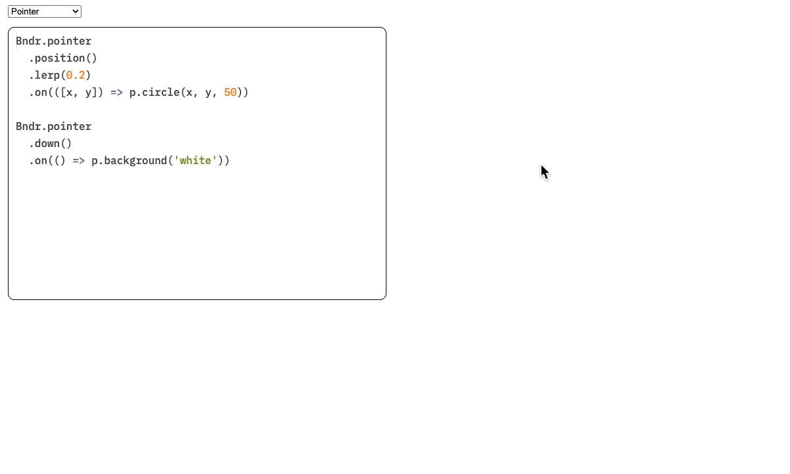

<div align="center">

  

  <h1>RxIO</h1>
  <p>🖱️ ⌇ ⌨️ ⌇ 🎹 ⌇ 🎮 ⌇ 🖊️ ⌇ 👆</p>

  

<a href="https://baku89.github.io/bndr-js/">Doc</a> ⌇ <a href="https://baku89.github.io/bndr-js/sandbox">Sandbox</a> ⌇ <a href="https://baku89.github.io/bndr-js/api/">API</a> ⌇ <a href="https://github.com/sponsors/baku89">Become a Sponsor</a>

<p>
  <a href="https://www.npmjs.org/package/rxio">
    
  </a>
  <a href="http://spdx.org/licenses/MIT">
    
  </a>
</p>

</div>

**RxIO** is an [RxJS](https://rxjs.dev/)-based library for composing user-input streams from devices such as mice🖱️, styluses🖊️, touch inputs👆, keyboards⌨️, [MIDI](https://developer.mozilla.org/en-US/docs/Web/API/Web_MIDI_API) controllers🎹, and [gamepads](https://developer.mozilla.org/en-US/docs/Web/API/Gamepad_API)🎮. It provides device sources as plain RxJS Observables, plus a few input-specific operators and combinators that the standard RxJS library doesn't cover. Developed and maintained by [Baku Hashimoto](https://baku89.com).

Potential use cases:

- ⚡️ Associating user inputs with arbitrary triggers for VJing
- 🎨 Introducing manual operations in generative art

## Supported devices

- 👆 Pointer (mouse, stylus, touch) — all `PointerEvent` parameters (pressure, tilt, multi-touch)
- ⌨️ Keyboard
- 🎹 MIDI — CC and velocity
- 🎮 Gamepad — vendor-specific button names (JoyCon, PS5, Xbox)

## Install

```sh
npm install rxio rxjs
```

`rxjs` is a peer dependency — install it alongside.

## Example

```ts
import {Keyboard, Pointer, Gamepad, Midi} from 'rxio'
import {merge, cascade} from 'rxio/combinators'
import {rising, lerp} from 'rxio/operators'
import {throttleTime} from 'rxjs'
import {vec2} from 'linearly'

// Each device exposes pipeable Observables.
Pointer.pressed().subscribe(pressed =>
	console.log('Pointer %s', pressed ? 'pressed' : 'released')
)

// Smooth a pointer position with rAF-based lerp.
Pointer.position()
	.pipe(lerp(vec2.lerp, 0.1))
	.subscribe(([x, y]) => console.log('Pointer moved: [%f, %f]', x, y))

// Keyboard shortcuts.
Keyboard.shortcut('shift+c').subscribe(() => console.log('shift+c'))
Keyboard.pressed('a').subscribe(p => console.log(`Key 'a' ${p ? 'down' : 'up'}`))

// MIDI velocity from channel 0, note 50.
Midi.note(0, 50).subscribe(v => console.log('MIDI #50: %d', v))

// Gamepad analog stick.
Gamepad.axis(0).subscribe(([x, y]) => console.log('Axis 0: [%f, %f]', x, y))

// Mix bang sources, preserving the glyph metadata for visualization UIs.
merge(Keyboard.shortcut('cmd+s'), Gamepad.button('a').pipe(rising())).subscribe(save)
cascade(
	Keyboard.pressed('a'),
	Keyboard.pressed('b'),
	Keyboard.pressed('c'),
).subscribe(t => console.log(t ? 'a → b → c held' : 'released'))

// Mix freely with standard RxJS operators.
Keyboard.shortcut('cmd+s')
	.pipe(throttleTime(500))
	.subscribe(save)
```

## Tree-shakable subpath imports

Each device and operator group is also published as a subpath, so bundlers can drop unused devices entirely:

```ts
import * as Keyboard from 'rxio/keyboard'
import {lerp} from 'rxio/operators'
import {merge} from 'rxio/combinators'
```

## Glyph metadata

Sources return a `GlyphedObservable<T>` — an `Observable<T>` with a `glyph: Glyphs` property describing the input visually. Each glyph is either an iconify reference or a text literal, so a sequence like `[⌘, "S"]` can mix iconography with letter characters. Useful for "press cmd+S to save" tooltips and command palettes. Once you `pipe()` through arbitrary RxJS operators, the glyph is dropped and the result is a plain `Observable`. The glyph-aware combinators in `rxio/combinators` (`merge`, `combineLatest`, `cascade`) join the glyphs of their inputs and shadow the same-named RxJS exports when both are imported.

```ts
const s = Keyboard.shortcut('cmd+s')
s.glyph // → [{type: 'iconify', icon: 'mdi:apple-keyboard-command'}, 'S']
```

## License

MIT. See the included [LICENSE file](./LICENSE).
