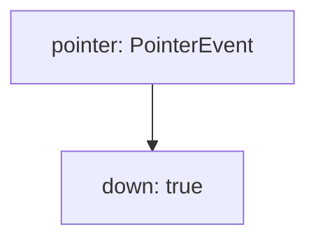
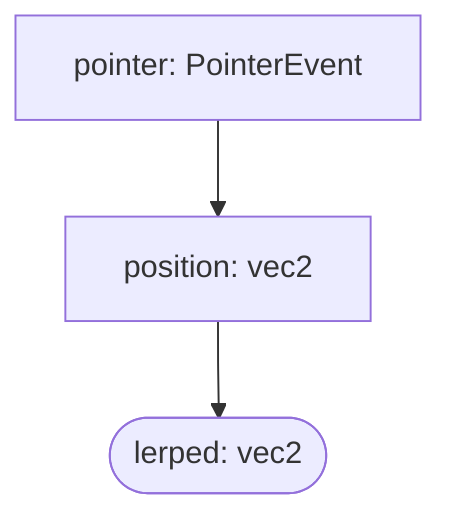
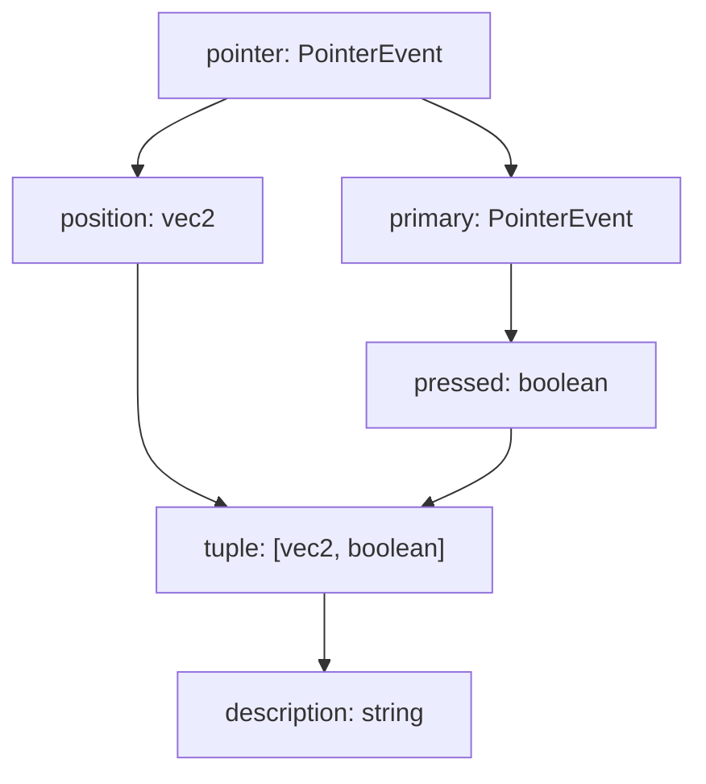

# Guide

## Install

```sh
npm i bndr-js
```

## Basic Usage

The simplest sample code using Bndr is as follows.

```ts
import {Emitter} from 'bndr-js'

Bndr.pointer().position().log(console.log)
```

It logs the coordinates to the console when the pointer moves over the window.

## Emitter

An Emitter in Bndr refers to an object that fires a single type of event. It is the most basic and central concept in this library.

In many cases, objects such as Window, HTMLElement, and EventEmitter fire multiple types of events and register event listeners with the pattern like `addEventListener(eventName, callback)`. In contrast, an Emitter in Bndr always fires only a single type of event. This means that you don't need to distinguish event names, and you register event listeners with just `on(callback)`.

For example, there are events such as `pointermove` and `pointerdown` for input from pointing devices, but, in Bndr, the function `Bndr.pointer()` that returns an Emitter for handling the pointer fires `PointerEvent` type events without distinguishing them. To get an Emitter that fires only when "the mouse is pressed", you can do the following.

```ts
import * as Bndr from 'bndr-js'

const pointer: Bndr<PointerEvent> = Bndr.pointer()
const mousedown: Bndr<PointerEvent> = pointer.filter(
	e => e.pointerType === 'mouse' && e.type === 'pointerdown'
)

mousedown.on(e => console.log('Mouse pressed'))
```

Bndr also provides built-in filters and transformation methods, so the above code can be written in one line as follows.

```ts
Bndr.mouse().down().on(e => console.log('Mouse pressed')
```

The advantage of this design is that you can separate your concerns into “what side effects to cause when the Emitter of a certain type fires” without writing logic to ignore some of events or extract necessary values in a single callback function. Also, by describing a series of processes for firing, propagating, and transforming events in a modular form centered around the Emitter object, it leads to better code visibility.

The processing in Bndr is similar to the way of combining patches in visual programming environments such as Max/MSP, Quartz Composer, and TouchDesigner. Just as you create music or visuals by combining nodes and patches, in Bndr, you can build an object that fires events of a certain type at a specific timing by combining Emitters. The above example can also be seen as a node structure like this.



Let's take another example. The following is an Emitter that gets the position of the pointer and smoothes it with lerp interpolation.

```ts
const pointer: Emitter<PointerEvent> = Bndr.pointer()
const position: Emitter<vec2> = pointer.position()
const lerped: Emitter<vec2> = position.lerp(vec2.lerp, 0.2)
```

This code corresponds to a structure like this if it were to be represented in a node-based UI.



## (Un)registering event listeners

Registering and unregistering event listeners can be done in the same way as with EventEmitter.

```ts
emitter.on(([x, y]) => circle(x, y, 10))
emitter.once(console.info)
emitter.off(console.info)
```

When using Bndr, you often need to output to the console for debugging purposes, and in such cases, the `log` method is useful. Also, you can use the `value` property to get the value of the last event fired.

```ts
emitter.log()
emitter.value // `undefined` when the Emitter has not yet fired any event.
```

## Types of Emitters

There are roughly the following types of Emitters.

- **Generator**: An Emitter that receives external input such as devices and signals and fires it as an event. For example, the Emitters returned by `Bndr.pointer`, `Bndr.keyboard`, and `Bndr.midi` are of this type.
- **Filter**: An Emitter that monitors events fired by a single Emitter and, depending on the condition, ignores it, transforms the payload, or fires it after performing time-based processing such as delay and smoothing. You can create a filter Emitters by using methods such as `Emitter.filter`, `Emitter.map`, `Emitter.delay`, `Emitter.throttle`, and `Emitter.lerp` on an existing Emitter.
- **Combinator**: An Emitter that combines events fired by multiple Emitters and fires them as a new event. You can create a combinator Emitter by using methods such as `Bndr.merge` and `Bndr.combine`.

These are not strictly distinguished. A filter Emitter can also be fired manually with `emitter.emit(value)` even if there is no firing from the upstream.

## Stateful Emitter

Some of the methods create Emitters that hold state internally.

For example, `Bndr.pointer()` is not stateful, while `Bndr.pointer().down()` holds the previous state to detect the moment when the pointer is pressed. Also, an Emitter generated by `Emitter.fold` method holds state. The following example is an Emitter that counts the number of times the pointer is pressed.

```ts
const counter = Bndr.pointer()
	.down()
	.fold(count => count++, 0)
```

An internal state cannot be directly referenced or modified from the outside. Instead, you can reset it using the `Emitter.reset` method. You can also check whether an Emitter is stateful with the `Emitter.stateful` property.

`Emitter.lerp` and `Emitter.delay` are also stateful Emitters. When the upstream Emitter is fired, the value is held as the internal state, and in the case of `lerp`, it continues to fire until the interpolation of the value is completed, and in the case of `delay`, it fires after the specified time. You can reset the internal state and cancel subsequent firing using the `reset` method.

## Branching and merging events

You can describe more complex event propagation by using combinators. The following is an example of generating an Emitter that converts the position of the pointer and whether it is pressed into a string.

```ts
const pointer = Bndr.pointer()
const position = pointer.position()
const pressed = pointer.primary.pressed()

const description = Bndr.tuple(position, pressed).map(
	([position, pressed]) => `position=${position} pressed=${pressed}`
)
```



## Vector and Transform

In Bndr, vectors and matrices are represented as plain 1D arrays of numbers. For example, a position is `[x, y]`, and a 2D affine transformation is `[a, b, c, d, tx, ty]`. These data can be manipulated using libraries such as [Linearly](https://baku89.github.io/linearly) or [gl-matrix](https://glmatrix.net/).

```ts
import {vec2, mat2d} from 'linearly'

Bndr.pointer()
	.position()
	.map(p => vec2.scale(p, 0.5))
	.on(([x, y]) => circle(x, y, 10))
```
