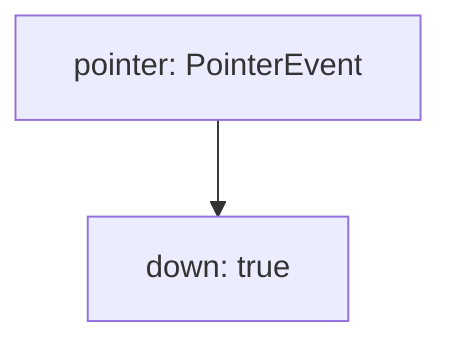
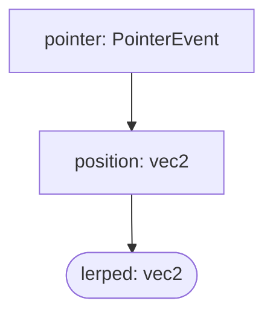
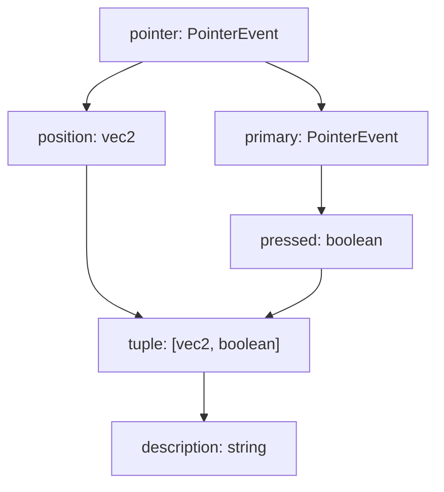

# ガイド

## インストール

```sh
npm i bndr-js
```

## 基本的な使い方

最も簡単な例として、ポインターが動いた時にコンソールに座標を表示するコードを書いてみましょう。

```ts
import {Emitter} from 'bndr-js'

Bndr.pointer().position().log(console.log)
```

## Emitter

Bndr における [Emitter](../api/classes/Emitter) とは、単一の型のイベントを発火するオブジェクトを指します。このライブラリにおける最も基本的かつ中心的な概念です。

Window、HTMLElement、EventEmitter といったオブジェクトは、多くの場合、複数の種類のイベントを発火し、`addEventListener(eventName, callback)`のような形でイベントリスナーを登録します。一方 Bndr における Emitter はこれらとは異なり、常に単一のタイプのイベントのみを発火します。つまり、イベント名を区別する必要が無いため、[`on(callback)`](../api/classes/Emitter#on)のようにイベントリスナーを登録することになります。

Bndr では、ポインターやキーボード、MIDI といった入力デバイスの種類ごとに、そのデバイスからのあらゆる入力を扱うための最も一般的なイベント型と紐づけられた Emitter が用意されています。その入力のうち、特定のものにのみ反応したり、イベントオブジェクトから値を取り出すには、[`Emitter.filter`](../api/classes/Emitter#filter) や [`Emitter.map`](../api/classes/Emitter#map) などをメゾッドチェーン状に繋げたり組み合わせます。そして必要な型の Emitter を得たところで、`on` メソッドを使ってコールバック関数を登録するというのが Bndr における基本的な処理です。

例えば、ポインティングデバイスからの入力に関するイベントには`pointermove`や`pointerdown` などがありますが、Bndr におけるポインターを扱うオブジェクトを返す関数 [`Bndr.pointer()`](../api#pointer) は、それらのイベントを区別せずに`PointerEvent` 型のイベントを発火し続けます。そのうち「マウスが押された瞬間」にのみ発火するエミッターを得るには、以下のように行います。

```ts
import * as Bndr from 'bndr-js'

const pointer: Bndr<PointerEvent> = Bndr.pointer()
const mousedown: Bndr<PointerEvent> = pointer.filter(
	e => e.pointerType === 'mouse' && e.type === 'pointerdown'
)

mousedown.on(e => console.log('Mouse pressed'))
```

Bndr では、良く使うフィルターや変換処理をビルトインで提供しているため、上記のコードは以下のように一行で書くこともできます。

```ts
Bndr.mouse().down().on(e => console.log('Mouse pressed')
```

このような設計をとる利点は、一つのコールバック関数の中でイベントを無視するロジックや必要な値を取り出す処理を書くことなく、**その型 Emitter が発火した際にどのような副作用を起こすか**にのみ関心を分離することにあります。また、イベントが発火し、伝搬・変換する一連の処理を、Emitter というオブジェクトを中心としたモジュラー性の高い形で記述することで、コードの見通しを良くすることに繋がります。

Bndr における処理は、Max/MSP や Quartz Composer、TouchDesigner などのビジュアルプログラミング環境においてパッチを組み合わせる様子にも似ています。ノードやパッチを組み合わせて一つの音楽やビジュアルを作り出すように、Bndr においても Emitter を組み合わせることで、所定のタイミングある型のイベントを発火するオブジェクトを構築することができます。上記の例は、以下のようなノード構成として捉えることも出来ます。



もう一つ例をあげてみましょう。以下は、ポインターの位置を取得し、それを lerp 補間でスムージング処理する Emitter です。

```ts
const pointer = Bndr.pointer()
const position = pointer.position()
const lerped = position.lerp(vec2.lerp, 0.1)
```

このコードは、以下のようなノード構成として捉えることができます。



## イベントリスナーの登録

イベントリスナーの登録や解除は、EventEmitter と同様に以下のようなパターンで行うことができます。

```ts
emitter.on(([x, y]) => circle(x, y, 10))
emitter.once(console.info)
emitter.off(console.info)
```

Bndr を使っているとはデバッグ用にコンソール出力する場面がよくありますが、そのようなときは[`Emitter.log`](../api/classes/Emitter#log) メソッドが便利です。また、[`Emitter.value`](../api/classes/Emitter#value) プロパティを使って、最後に発火されたイベントの値を取得することもできます。

```ts
emitter.log()
emitter.value // イベントがまだ一度も発火されていない場合は `undefined`
```

## Emitter の種類

Emitter には、おおよそ以下のような種類があります。

- **ジェネレーター**: デバイスや通信など外部の入力を受け取り、それをイベントとして発火する Emitter です。例えば、[`Bndr.pointer`](../api#pointer)、[`Bndr.keyboard`](../api#keyboard)、[`Bndr.midi`](../api#midi) が返す Emitter がこれに当たります。
- **フィルター**: ある単一の Emitter が発火したイベントを監視し、条件に応じてそれを無視するか、あるいはペイロードの値を変換したり、ディレイやスムージングといった時間的な処理など行った上で発火する Emitter です。既存の Emitter に対して[`Emitter.filter`](../api/classes/Emitter#filter)、[`Emitter.map`、`Emitter.delay`](../api/classes/Emitter#delay)、[`Emitter.throttle`](../api/classes/Emitter#throttle)、[`Emitter.lerp`](../api/classes/Emitter#lerp) などのメソッドを使って生成することができます。
- **コンビネーター**: 複数の Emitter が発火したイベントを組み合わせ、新たなイベントとして発火する Emitter です。[`Bndr.tuple`](../api/classes/Emitter#reset)、[`Bndr.combine`](../api#combine) などのメソッドを使って生成することができます。

これらは厳密には区別されていません。フィルターの Emitter は、上流からの発火が無くとも [`emitter.emit(value)`](../api/classes/Emitter#emit) で手動で発火することも出来ます。

## ステートフルな Emitter

また、Emitter には状態を持つものと持たないものがあります。例えば、`Bndr.pointer()` は状態を持たない一方で、`Bndr.pointer().pressed()` は、ポインターが押された瞬間を検知するために、直前の状態を保持しています。また、 [`Emitter.fold`](../api/classes/Emitter#fold) メゾッドで生成される Emitter なども状態を持ちます。次の例は、ポインターが押された回数をカウントする Emitter です。

```ts
const counter = Bndr.pointer()
	.pressed()
	.fold(count => count++, 0)
```

ステートフルな Emitter は、内部状態を外部から直接参照したり変更することは出来ません。その代わりに、[`Emitter.reset`](../api/classes/Emitter#reset) メソッドを使って内部状態をリセットすることができます。その Emitter がステートフルかどうかは、[`Emitter.stateful`](../api/classes/Emitter#stateful) プロパティで確認することができます。

`Emitter.lerp` や`Emitter.delay`といった時間的な処理を行うメソッドを使って生成される Emitter もまたステートフルです。上流の Emitter が発火されると、その値を内部状態として保持し、`lerp`であれば値の補間が収まるまで継続的に発火し、`delay`の場合指定時間後に発火しますが、`reset`メゾッドを用いることで内部状態としてのスケジューラーをリセットし、以後の発火をキャンセルすることができます。

## イベントの分流と合流

コンビネーターを用いて、より複雑なイベントの伝搬を記述することができます。以下は、ポインターの位置と押されているかどうかを組み合わせて、それらの値を文字列に変換する Emitter を生成する例です。

```ts
const pointer = Bndr.pointer()
const position = pointer.position()
const pressed = pointer.primary.pressed()

const description = Bndr.tuple(position, pressed).map(
	([position, pressed]) => `position=${position} pressed=${pressed}`
)
```



## ベクトル、トランスフォーム

Bndr におけるベクトルや行列は、プレーンな 1 次元の数値配列として表現されています。例えば、位置は`[x, y]`、2 次元のアフィン変換は`[a, b, c, d, tx, ty]`といったようにです。これらのデータの操作は、[Linearly](https://baku89.github.io/linearly)や[gl-matrix](https://glmatrix.net/) などのライブラリを用いて操作することが出来ます。

```ts
import {vec2, mat2d} from 'linearly'

Bndr.pointer()
	.position()
	.map(p => vec2.scale(p, 0.5))
	.on(([x, y]) => circle(x, y, 10))
```
