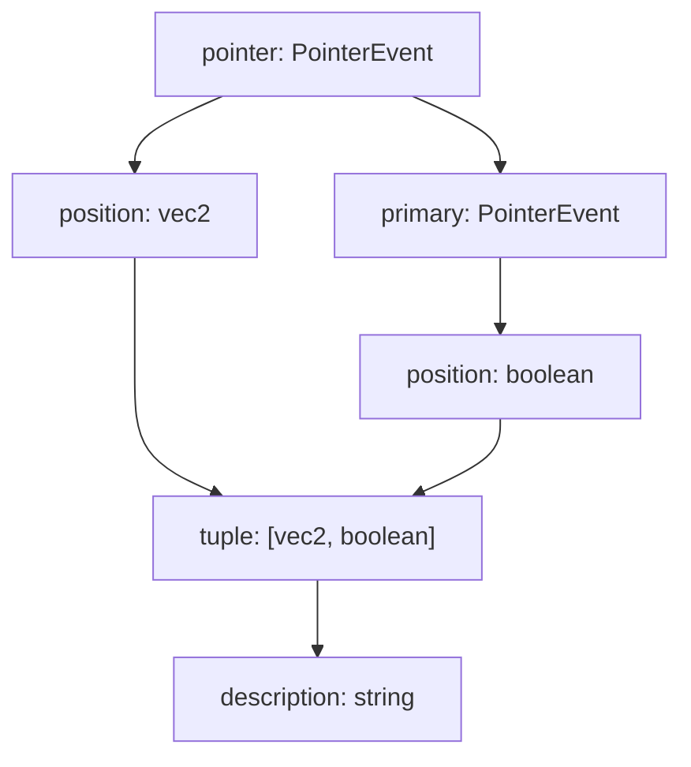

# Overview

Bndr.js allows you to generate [Emitters](https://baku89.github.io/bndr-js/docs/classes/Emitter.html) of various types to suit your needs by chaining, splitting, and merging them like a graph structure. (Imagine Node-based appliations)

For instance, the following example extracts the position from the input from the pointer and applies lerp interpolation.

```js
const pointer = Bndr.pointer()
const position = pointer.position()
const lerped = position.lerp(vec2.lerp, 0.2)
```

This code corresponds to a structure like this if it were to be represented in a node-based UI.


Events fired from the upstream Emitters are propagated to the downstream Emitters one after another. And the `lerped` at the most downstream, as its name suggets, continues to fire `vec2`-type events until its internal value reaches the last value fired from its upsteram, even after the `position` has stopped firing.

In this case, `lerped` is distinguished from the other two as a stateful Emitter, in that it holds the current and target values as its state. A emitter with round corners in above and following diagram represents stateful Emitter.

```js
console.log(position.stateful) // -> false
console.log(lerped.stateful) // -> true
lerped.reset() // Reset the state
```

The second example includes separation and merging.

```js
const pointer = Bndr.pointer()
const position = pointer.position()
const pressed = pointer.primary.pressed()
const tuple = Bndr.tuple(position, pressed)
const description = tuple.map(
	([position, pressed]) => `position=${position} pressed=${pressed}`
)
```


