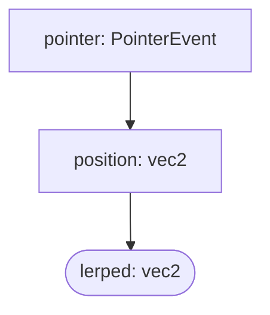
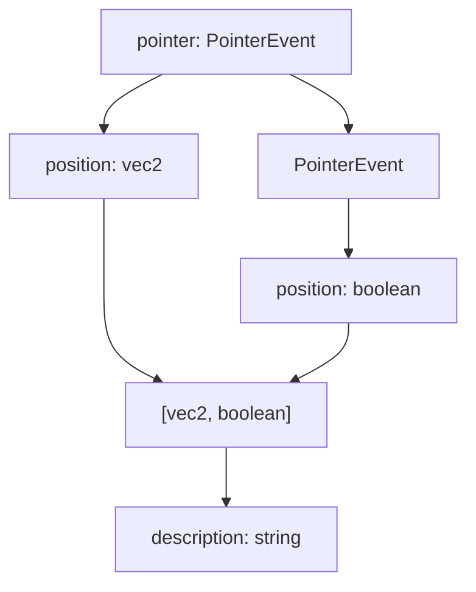

# Overview

The simplest sample code using Bndr.js is as follows.

```ts
import {Emitter} from 'bndr-js'
import {vec2} from 'linearly'

Bndr.pointer().position().log(console.log)
```

The above example logs the coordintes in the console when the pointer moves over the window. Note that Bndr.js uses [Linearly](https://baku89.github.io/) for manipulating vectors and matrices.

## Basic usage

Bndr.js allows you to generate [Emitters](https://baku89.github.io/bndr-js/docs/classes/Emitter.html) of various types to suit your needs by chaining, splitting, and merging them like a graph structure. (Imagine Node-based appliations)

For instance, the following example extracts the position from the input from the pointer and applies lerp interpolation.

```ts
const pointer: Emitter<PointerEvent> = Bndr.pointer()
const position: Emitter<vec2> = pointer.position()
const lerped: Emitter<vec2> = position.lerp(vec2.lerp, 0.2)
```

This code corresponds to a structure like this if it were to be represented in a node-based UI.



Events fired from the upstream Emitters are propagated to the downstream Emitters one after another. And the `lerped` at the most downstream, as its name suggets, continues to fire `vec2`-type events until its internal value reaches the last value fired from its upsteram, even after the `position` has stopped firing.

In this case, `lerped` is distinguished from the other two as a stateful Emitter, in that it holds the current and target values as its state. An emitter with round corners in above and following diagram represents stateful Emitter. You can use [`stateful`](https://baku89.github.io/bndr-js/docs/classes/Emitter.html#stateful) to check whether an Emitter is stateful, and [`reset`](https://baku89.github.io/bndr-js/docs/classes/Emitter.html#reset) method to reset the internal state to initial one.

```ts
console.log(position.stateful) // -> false
console.log(lerped.stateful) // -> true
lerped.reset() // Reset the state
```

Each Emitter instance corresponds to a single type of event that represents “the event associated with the emitter is just fired”. So you don't need to specify a name of event unlike common event-driven patterns such as `window.addEventListener('resize', cb)`.

```ts
lerped.on(([x, y]) => circle(x, y, 10))
lerped.once(console.info)
lerped.off(console.info)
```

You can also log events fired from the Emitter by using [`log`](https://baku89.github.io/bndr-js/docs/classes/Emitter.html#log) method. And [`value`]() to get the latest value the Emitter fired.

```ts
lerped.log()
lerped.value // `undefined` when the Emitter has not yet fired any event.
```

## Splitting and merging event flows

The second example includes separation and merging.

```ts
const pointer = Bndr.pointer()
const position = pointer.position()
const pressed = pointer.primary.pressed()

const description = Bndr.tuple(position, pressed).map(
	([position, pressed]) => `position=${position} pressed=${pressed}`
)
```



## Stateful emitter

As I mentioned, some of methods creates Emitter which holds state internally. [`lerp`](https://baku89.github.io/bndr-js/docs/classes/Emitter.html#lerp), [`trail`](https://baku89.github.io/bndr-js/docs/classes/Emitter.html#trail), and [`delay`](https://baku89.github.io/bndr-js/docs/classes/Emitter.html#delay) are the examples to return stateful Emitters. You can also compose a custom stateful Emitter.

### Counter

```ts
const counter = Bndr.pointer()
	.down()
	.fold(v => v + 1, 0)
```

### Toggle

```ts
const toggle = Bndr.keyboard()
	.keydown('a')
	.fold(b => !b, false)
```
